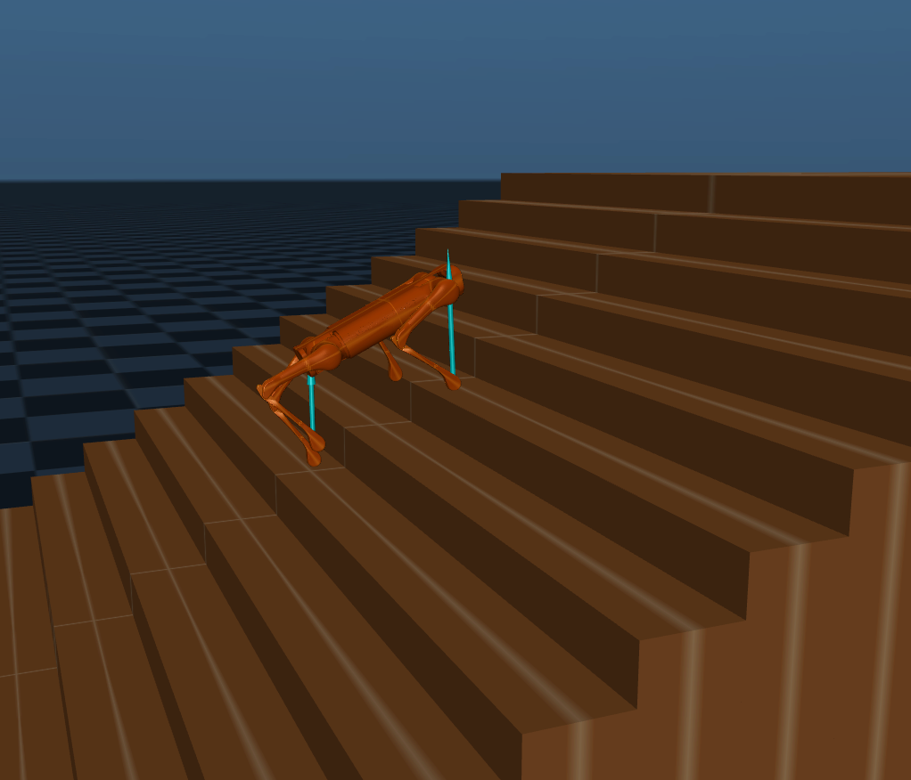

## Research Interests

- **Robot Control and Decision Making:**: Optimal Control, Reinforcement Learning
- **Robot Perception and Artificial Intelligence:** Signal Processing, Patern Recognition, Deep Learning

## Experience

- **[May 2020 - Present] Southern University of Science and Technology**
   
  Research Assistant in CLEAR Lab
  
  Principal Investigator: [Prof. Wei Zhang](https://www.wzhanglab.site/)
  - Project: Motion Control of Legged Robot 

- **[Sep 2017 - Jan 2020] Beihang University**
   
  M.Eng. in Control Science and Engineering 
    
  Advisor: [Prof. Weihai Chen](https://dept3.buaa.edu.cn/szjs/zzjs/dgdzjxsyzx1/js/cwh.htm)
   
  - Thesis: sEMG-based Extraction of Motion Intention and Assist-As-Needed Control of Rehabilitation Robot

- **[Sep 2013 - Jul 2017] University of Electronic Science and Technology of China**
   
  B.Eng. in Mechanical and Automation Engineering
   
  - Thesis: Laser-SLAM based on Iterative Closest Point and Graph Optimization
  

## Publications

- **sEMG-based recognition of composite motionwith convolutional neural network**
   
  **Shuhao Qi**, Xingming Wu, Weihai Chen, Jianbin Zhang, Jianhua Wang
   
  Sensors and Actuators, A: Physical (Q1, IF=2.904).
  [[PDF](./assets/pdf/2020sEMG.pdf)] 

- **Recognition of composite motions based on semg via deep learning**
   
  **Shuhao Qi**, Xingming Wu, Jianhua Wang, Jianbin Zhang
   
  14th IEEE Conference on Industrial Electronics and Applications (ICIEA 2019).
   
 
- **Damping vibration analysis of adual-axis precision force sensor based on passive eddy current**
   
  Xiantao Sun, Wenjie Chen, Weihai Chen, **Shuhao Qi**, Jun Jiang, Cungang Hu, Jun Tao
   
  Journal of Physics D: Applied Physics.
   
 
- **Design and analysis of a large-rangeprecision micromanipulator**
   
  Xiantao Sun, Wenjie Chen, Weihai Chen, **Shuhao Qi**, Wang Li, Cungang Hu, Jun Tao
   
  Smart Materials and Structures.
   
 

## Selected Projects

### Quadruped Robot

- Stairway Climbing of Quadruped Robot(Optimal Control, Jun. 2020–Present)
   
  Extract environment information from depth camera and utilize MPC to make robot track the reference trajectory.
   
  

  

### Rehabilitation Robot

- sEMG-based Active Control of Rehabilitation Robot (Force Control, Jan. 2019–Jan. 2020) 
  Adjust the joint torque of the upper-limb rehabilitation robot according to the amplitude of sEMG signals.

- sEMG-based Motion Recognition (Deep Learning, Jun. 2018–Jan. 2019)  
  Transform sEMG signals into the defined “sEMG Images” and utilize CNN to classify corresponding motions.
   
  

  

### Wheeled Mobile Robot

- Laser-SLAM based on ICP and Graph Optimization (SLAM, Oct. 2016–Jun. 2017)
   
  Establish a scan-to-map ICP algorithm and utilize Least Square method to optimize graph after close-loop detection.
- RoboMasters Competition (Embedded System, Mar. 2015–Jul. 2015)
   
  Design “Gunner” robot which can accurately hit the target from a long distance

### Artificial Intelligence
- Tianchi Competition: Zero-Shot Detection (Transfer Learning, Sep. 2018–Nov. 2018)
   
  Use ResNet to extract visual features and combine semantic information to classify unseen categories.(Rank: 32/3225)

### Automation Equipment
- Control of Precision Micromanipulator (Signal Processing, Mar. 2019–Jun. 2019)
   
  Establish upper machine to control piezoceramics and process signals from multiple sensors.

- Automatic Packaging Machine (Embedded System, Feb. 2016–May 2016)
   
  Design an automatic machine for small merchants, which can fold the carton and seal tape automatically.

## Awards
- **[Jun 2019]** Best Paper Finalist Certificate of ICIEA2019
- **[Jun 2017]** Outstanding Graduate of UESTC
- **[Jul 2015]** National First Prize & Best Technology Award of RoboMasters

## Services
- Invited Reviewer for IEEE Sensors Journal
- Invited Reviewer for ROBIO2018 
